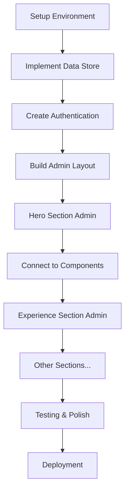

# Portfolio Admin Interface Documentation

This documentation provides comprehensive guidance for implementing an administrative interface to manage all content sections of the Thomas Stefen portfolio website.

## 📋 Document Overview

### 📊 [Admin Implementation Roadmap](./admin-implementation-roadmap.md)
**Purpose**: Complete project roadmap with phases, timelines, and feature specifications
**For**: Project managers, developers, stakeholders
**Contains**:
- Detailed analysis of current portfolio structure
- 5-phase implementation plan (12 weeks total)
- Data schemas for all sections
- Security considerations and testing strategy
- Risk mitigation and success metrics

### 🔧 [Technical Specifications](./technical-specifications.md)
**Purpose**: Detailed technical guidelines and architecture specifications
**For**: Senior developers, technical leads
**Contains**:
- State management architecture using Zustand
- Component specifications and patterns
- API design (REST/GraphQL)
- Security implementation details
- Performance optimization strategies
- Testing frameworks and examples

### 🚀 [Quick Start Guide](./quick-start-guide.md)
**Purpose**: Step-by-step implementation guide for developers
**For**: Developers starting the implementation
**Contains**:
- Prerequisites and setup instructions
- 10-day phase-by-phase implementation plan
- Complete code examples and patterns
- Common utilities and troubleshooting
- Development tips and resources

## 📋 Implementation Summary

### What You'll Build
An admin interface that allows dynamic management of:
- **Hero Section**: Personal info, rotating titles, social links, profile image
- **Experience Section**: Work history, skills, employment details
- **Education Section**: Academic background, degrees, certifications
- **Skills Section**: Technical skills organized by categories
- **Projects Section**: Project portfolio with images, demos, and descriptions
- **Contact Section**: Contact form settings and social links

### Key Features
- 🔐 **Secure Authentication**: Password-protected admin access
- 📱 **Responsive Design**: Works on desktop and mobile devices
- 💾 **Data Persistence**: LocalStorage with future database support
- 🎨 **Real-time Preview**: See changes instantly
- 📤 **Import/Export**: Backup and restore functionality
- 🔄 **Drag & Drop**: Reorder items easily
- 📁 **File Upload**: Image management for projects and profiles

### Technology Stack
- **Frontend**: React, Vite, Tailwind CSS
- **State Management**: Zustand with persistence
- **Forms**: React Hook Form + Zod validation
- **UI Components**: Radix UI + existing design system
- **File Handling**: React Dropzone
- **Testing**: Vitest + Testing Library

## 🎯 Getting Started

1. **Read the Roadmap** - Understand the full scope and timeline
2. **Review Technical Specs** - Understand the architecture and patterns
3. **Follow Quick Start Guide** - Begin implementation step-by-step

## 📊 Project Phases

| Phase | Duration | Focus | Deliverables |
|-------|----------|--------|--------------|
| **Phase 1** | 2 weeks | Foundation Setup | Data store, authentication, routing |
| **Phase 2** | 2 weeks | Core Components | CRUD operations, forms, file uploads |
| **Phase 3** | 4 weeks | Section Interfaces | Admin panels for all portfolio sections |
| **Phase 4** | 2 weeks | Advanced Features | Preview, import/export, analytics |
| **Phase 5** | 2 weeks | Security & Polish | Authentication, validation, optimization |

## 🛠️ Development Workflow



## 📁 File Structure (After Implementation)

```
src/
├── admin/                    # Admin interface
│   ├── components/
│   │   ├── common/          # Shared admin components
│   │   ├── forms/           # Form components
│   │   └── sections/        # Section-specific admin panels
│   ├── hooks/               # Admin-specific hooks
│   ├── pages/               # Admin pages
│   ├── store/               # State management
│   └── utils/               # Admin utilities
├── components/              # Existing portfolio components
├── data/                    # Data schemas and defaults
└── docs/                    # This documentation
```

## 🔒 Security Considerations

- **Authentication**: Secure password-based login
- **Data Validation**: Comprehensive input validation using Zod
- **XSS Protection**: Input sanitization for all user content
- **File Upload Security**: Restricted file types and sizes
- **Access Control**: Protected admin routes

## 📈 Success Metrics

- ✅ All portfolio sections manageable through admin interface
- ✅ Non-technical users can update content easily
- ✅ Admin interface loads within 2 seconds
- ✅ No unauthorized access to admin functions
- ✅ Zero data loss during operations

## 🚨 Important Notes

1. **Start Small**: Begin with the Hero section to establish patterns
2. **Test Frequently**: Each component should be tested as you build
3. **Mobile-First**: Ensure admin interface works on all devices  
4. **Performance**: Consider lazy loading for admin routes
5. **Backup Strategy**: Implement data export early in development

## 📞 Support & Resources

### Documentation Links
- [React Documentation](https://react.dev/)
- [Zustand Documentation](https://github.com/pmndrs/zustand)
- [React Hook Form](https://react-hook-form.com/)
- [Zod Validation](https://zod.dev/)
- [Tailwind CSS](https://tailwindcss.com/)

### Development Tips
- Use the existing design system and components where possible
- Follow the established code patterns in the current portfolio
- Test changes in both admin interface and public portfolio
- Consider TypeScript for better developer experience
- Document any deviations from the planned architecture

## 🔄 Next Steps

1. **Review all documentation** to understand the full scope
2. **Set up development environment** following the quick start guide
3. **Begin Phase 1 implementation** with data store and authentication
4. **Follow the day-by-day plan** in the quick start guide
5. **Expand gradually** to additional sections following established patterns

---

**Last Updated**: January 2024  
**Version**: 1.0  
**Author**: Portfolio Admin Interface Planning Team

This documentation should provide everything needed to successfully implement a comprehensive admin interface for the portfolio website. 